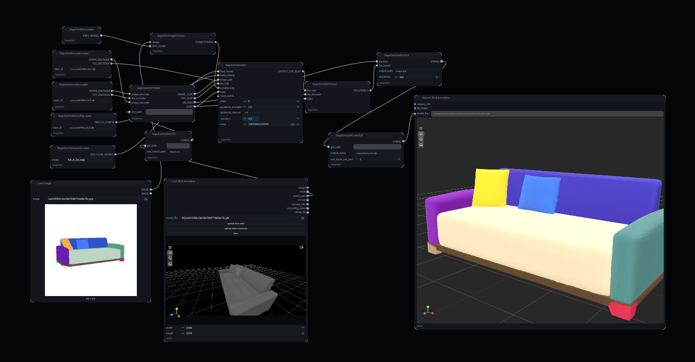

# ComfyUI-SegviGen



A ComfyUI implementation of SegviGen, providing precise 3D part segmentation for SegviGen.


## Installation

1.  Clone this repository to your `ComfyUI/custom_nodes/` folder.
2.  Install the required base dependencies:
    ```bash
    pip install -r requirements.txt
    ```
3.  Run the specialized installation script to handle custom CUDA wheels and internal libraries:
    ```bash
    python install.py
    ```

## Key Features

- **Automated Model Downloading**: All model components (Trellis base, SegviGen checkpoints, BiRefNet, DinoV3) are automatically downloaded on first use.
- **Decoupled Loaders**: Individual control over Shape/Tex Encoders and Decoders for optimal VRAM management.
- **Memory Management**: Built-in support for DMA-based loading (`load_torch_file`), RAM-safe initialization (`init_empty_weights`), and proactive cache clearing.
- **Granular Pipeline**: Modular nodes for preprocessing, conditioning, sampling, and post-processing (VXZ, Latent Slats, Voxel, GLB).

## Node Overview

- **SegviGen Shape/Tex Loader Nodes**: Targeted loaders for individual TRELLIS components.
- **SegviGen Checkpoint Loader**: Loads the SegviGen flow checkpoints (Full/Interactive).
- **SegviGen Image Preprocessor**: Automates background removal (BiRefNet) and image preparation.
- **SegviGen Image To Cond**: Generates conditioning embeddings (DinoV3).
- **SegviGen Sampler**: Performs the core texture sampling with optional point-based guidance.
- **SegviGen Slat To Voxel**: Decodes texture latents to voxel representation.

## Acknowledgements

Original SegviGen implementation by [fenghora](https://huggingface.co/fenghora/SegviGen).
Uses [TRELLIS 2.0](https://huggingface.co/microsoft/TRELLIS.2-4B) by Microsoft.
